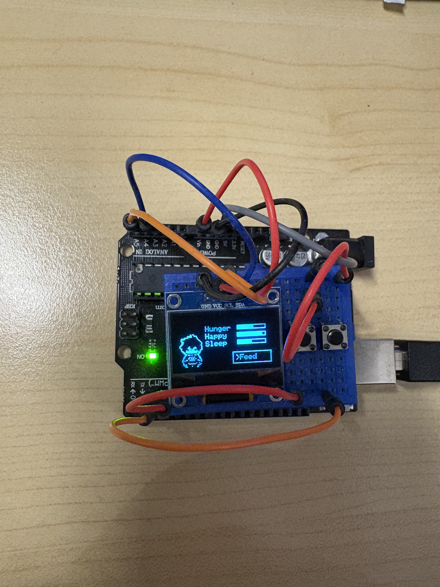
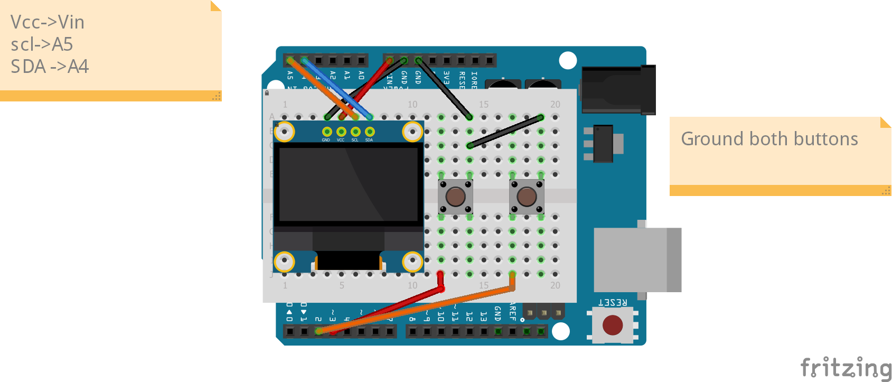

# 🐾 Arduino Tamagotchi — Virtual Pet on a 128×64 OLED

A fully interactive **virtual pet** built on an Arduino Uno using a 128×64 OLED display.  
More than just a toy, this project demonstrates how embedded systems can create meaningful interaction—turning an Arduino and an OLED display into a responsive, engaging virtual companion.  
This project features a menu system, animations, stat tracking, and a full user interface driven by two buttons.


---

## 📸 Demo Photo

<p float="left">
  
</p>

---

## 🎥 Demo Video

➡️ **[Click to watch the demo](https://drive.google.com/file/d/1y8yF7kn6yP-9p7HeFi6F-zXHzc7O5KB3/view?usp=sharing)**

---

## 🖼️ Wiring Diagram

Here is the full circuit layout for the Tamagotchi:



---

## 🎮 Features

### ⭐ Core Gameplay
- Feed, Sleep, Love, Play, and Data actions  
- Idle bobbing animation  
- Stats: **Hunger, Happiness, Sleep** (0–10 each)  
- Stats decay every **3 minutes**  
- Action log: tracks how many times each action is used  

### ⭐ Menu System
- One button scrolls through menu options  
- One button selects an action  
- Clean UI box displayed in the bottom-right corner  

### ⭐ Animations & Graphics
- Custom pet sprite  
- Feeding animation with steak image  
- Sleep screen (“Zzz…”)  
- Love message (“Love <3 Love <3”)  
- Play action shows “Exercising!!!”  

---

## 🛠️ Hardware Used

- **Arduino Uno / Nano**
- **128×64 I²C OLED Display**
  - Address: `0x3C`
  - Libraries: `Adafruit_GFX`, `Adafruit_SSD1306`
- **Two momentary buttons**
  - Scroll → Pin **3**
  - Select → Pin **2**
- Jumper wires / breadboard

**I²C Pins:**  
- SDA → A4  
- SCL → A5  

---

## 📂 Folder Structure

```
MyTamagotchi/
│
├── src/
│   ├── MyTamagotchi.ino
│   ├── Menu.h
│   ├── MyPetBitmap.h
│   └── Steak.h
│
├── assets/
│   └── sprites/
│       ├── Steak.png
│       └── TamagotchiPetZon.png
│
├── docs/
│   ├── tamagotchi_wiring_diagram.png
│   ├── tamagotchi_wiring_diagram.fzz
│   ├── Virtual_Pet_Photo.png
│
├── README.md
└── .gitignore
```
---

## ⚙️ How It Works

### 🧩 1. Menu State Machine
The `Menu` class controls:
- Scrolling through menu items  
- Detecting rising-edge button presses  
- Returning the selected `ActionType`  
- Rendering the menu box on the OLED  

Menu items:  
`Feed, Sleep, Love, Play, Data`

---

### 🧩 2. Idle Animation
The pet “bobs” using a timed vertical offset:

```cpp
if (millis() - lastBobTime > 150) {
  bobOffset += goingDown ? 1 : -1;
}
```

---

### 🧩 3. Actions
Feed → “Chomp!” animation + pet + steak
Sleep → Show “Zzz…” screen for 3 seconds
Love → Display custom message
Play → “Exercising!!!” text + +2 happiness
Data → Show log counters

### 🧩 4. Idle Animation
hunger--;
happiness--;
sleep--;


## ⭐ What I Learned
- Embedded UI/UX design on a 128x64 OLED
- State machine logic with menu navigation
- Bitmap-to-C array conversion for sprites
- Timer-based animations (bobbing + action animations)
- Handling input with clean edge detection logic
- Multi-file project organization in Arduino (src/assets/docs)
